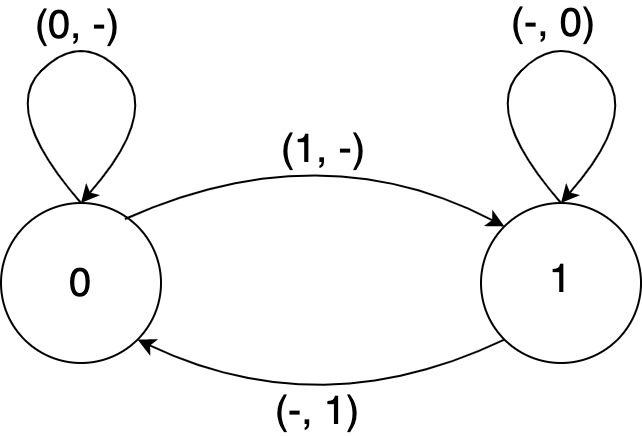
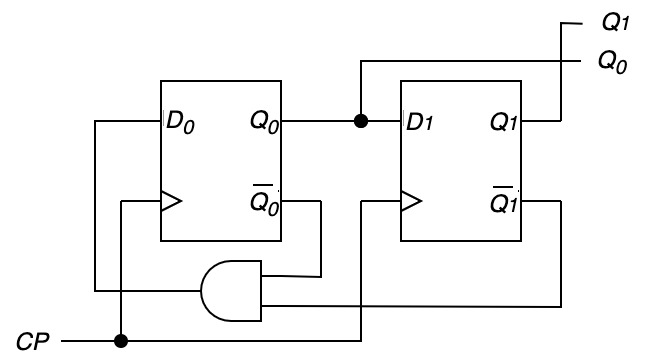

---
presentation:
  width: 1024
  height: 768

theme : "white"
transition : "default"
autoSlide : "0"
# autoSlideStoppable : "true"
title : "200603"
---

# 論理回路

`#200603`

---

---

## 系列機械による解析と設計

---

## 系列機械の定義

---

### 系列機械の定義

$K$
: 状態($q_i$)の集合

$\Sigma$
: 入力(0,1またはそれらの列)の集合

$\Delta$
: 出力(0,1またはそれらの列)の集合

$\delta: K\times \Sigma\to K$
: *遷移関数*

$\lambda: K\times \Sigma\to \Delta$
: 出力関数

これらの五つ組$(K,\Sigma,\Delta,\delta,\lambda)$を*系列機械*と呼ぶ.

---

## 遷移関数と出力関数

\[\begin{aligned}
\delta(q_i,I) & = q_j \\
\lambda(q_i,I) & = J
\end{aligned}\]

$q_j$
: 状態$q_i$のときに $I$ を入力した後の次状態

$J$
: 状態 $q_i$ のときに $I$ を入力した際の出力

--

## 遷移関数と出力関数の拡張

集合$A$の要素の列からなる集合を$A^*$と書くと,

\[\begin{align}
\delta^*: & K\times \Sigma^* \to K\\
\lambda^*:  & K\times \Sigma^* \to \Delta^*\\
\end{align}\]

と拡張される.

\[\begin{aligned}
\delta^*(q_i,I_1\ldots I_n) & = q_j \\
\lambda^*(q_i,I_1\ldots I_n) & = J
\end{aligned}\]

$q_j$
: 状態$q_i$のときに$n$個の列 $I_1\ldots I_n$ を入力した後の次状態

$J$
: 状態 $q_i$ のときに$n$個の列 $I_1\ldots I_n$ を入力した際の出力列

---

### 順序回路$\leftrightarrow$系列機械

- 順序回路の入出力(と状態)は系列機械で解析可能
- 系列機械と同じ入出力(と状態)を行う順序回路も設計可能

---

### 順序回路の解析

1. FFの数($n$)から状態の最大数($2^n$)を求める
1. 各状態遷移に対する入力条件表を用意
1. 入力条件表から拡大状態遷移表を作成
1. 拡大状態遷移表から得られる各ノードをエッジで結び, 入力条件(と出力)のラベルを付与

---

### 順序回路の解析(例1)

最も単純な順序回路の一つ: FF回路そのもの(JK-FF)
- 状態と出力が同一なのでムーアマシンで解析
  - 入力は$(J,K)$のペア
  - $T$ は無視
- 状態の数は$2^1=2$
  - 状態は0と1のみ

---

### JK-FFの入力条件表

$Q^t\to Q^{t+1}$ |$J$の条件| $K$の条件 | 状態動作
--- | --- | --- | --- 
$0\to 0$ | $0$ | - | 保持/リセット
$0\to 1$ | $1$ | - | 反転/セット
$1\to 0$ | - | $1$ | 反転/リセット
$1\to 1$ | - | $0$ | 保持/セット
[状態遷移に対するJK-FFの条件]

---

---

### 順序回路の解析

3進カウンタ

---

### 順序回路の解析

- FFは2: 状態の数は最大で$2^2=4$
- 順序回路の状態遷移表を作成

$CP$ | $(Q_1, Q_0)^t$ | $(Q_1,Q_0)^{t+1}$ 
 :---: | :---: | :---: 
| 1 | 0 0 | 0 1 
| 1 | 0 1 | 1 0 
| 1 | 1 0 | 0 0 
| 1 | 1 1 | - 

---

### 順序回路の解析

状態遷移表を